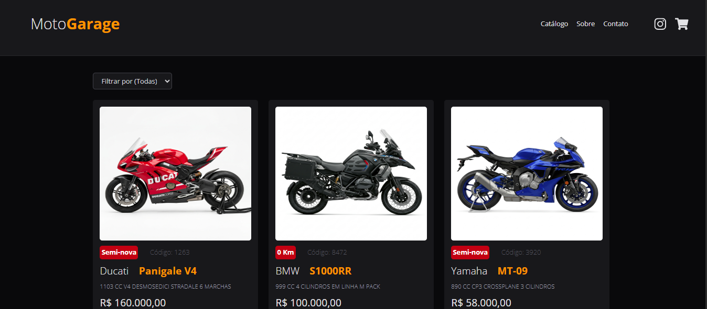

# 🏍️ MotoGarage

> Catálogo digital de motocicletas com filtros por categoria, desenvolvido com React + Vite + Tailwind CSS.

---

## 📸 Preview



---

## ✨ Funcionalidades

- 📋 **Catálogo de motos** renderizado dinamicamente a partir de um arquivo JSON
- 🔍 **Filtro por categoria** (Esportiva, Naked, Adventure, Custom)
- 🃏 **Cards informativos** com imagem, fabricante, modelo, condição, código, preço, ano e quilometragem
- ❤️ **Botão de favoritar** em cada card
- 📱 **Layout responsivo** com grid adaptável (1 → 2 → 3 colunas)
- 🎨 **Design dark mode** premium com paleta zinc + amber

---

## 🛠️ Tecnologias

| Tecnologia | Versão |
|---|---|
| [React](https://react.dev/) | 19 |
| [Vite](https://vitejs.dev/) | 8 |
| [Tailwind CSS](https://tailwindcss.com/) | 4 |
| [React Icons](https://react-icons.github.io/react-icons/) | 5 |

---

## 🚀 Como rodar o projeto

### Pré-requisitos
- [Node.js](https://nodejs.org/) instalado

### Passos

```bash
# Clone o repositório
git clone https://github.com/seu-usuario/motogarage.git

# Entre na pasta do projeto
cd motogarage

# Instale as dependências
npm install

# Rode o servidor de desenvolvimento
npm run dev
```

Acesse **`http://localhost:5173`** no seu navegador.

---

## 📁 Estrutura do Projeto

```
motogarage/
├── public/
│   ├── assets/          # Imagens das motocicletas
│   └── motos.json       # Mock de dados das motos
├── src/
│   ├── components/
│   │   ├── Header.jsx   # Navbar com logo e links
│   │   └── CardMoto.jsx # Card individual de cada moto
│   ├── pages/
│   │   └── Home.jsx     # Página principal com fetch e filtro
│   ├── App.jsx
│   └── index.css        # Estilos globais + fonte Open Sans
└── package.json
```

---

## 📌 Conceitos praticados

- Componentização com React
- Props e passagem de dados entre componentes
- `useState` e `useEffect` para gerenciar estado e efeitos colaterais
- `fetch` assíncrono para consumo de dados
- Filtro com estado derivado (sem mutação do estado original)
- CSS Grid e Flexbox com Tailwind CSS v4
- Layout responsivo com breakpoints

---

## 📄 Licença

Este projeto está sob a licença MIT.
